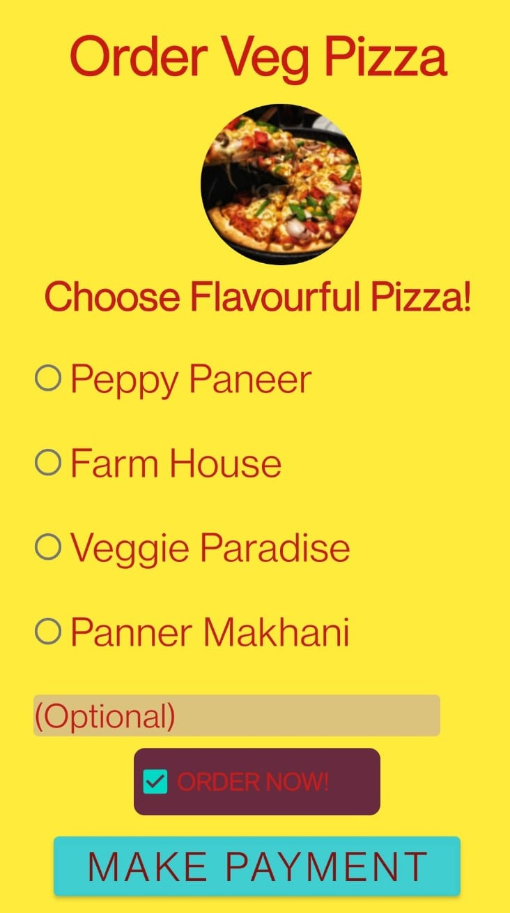

# Relative-Layout
<b>Created an application with relative layout which has background color yellow, text in red color and have the following components:
Edit text, Button , Radio button and checkbox. If user select a radio button or check box then that
display the selected item as Toast.</b>

